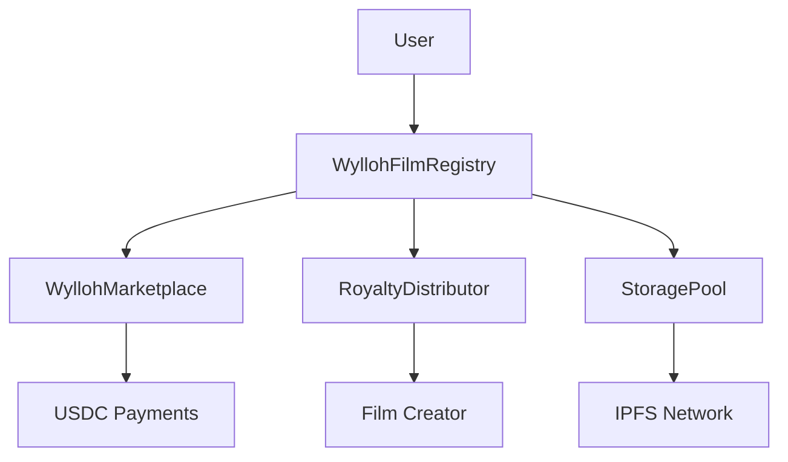

# 🎬 WYLLOH SMART CONTRACT ARCHITECTURE

## 📋 **ECOSYSTEM OVERVIEW**

Wylloh's smart contract architecture is designed for **infinite scalability** - supporting thousands of films with minimal gas costs through a unified registry approach.

### **🎯 CORE PHILOSOPHY**
- **Single Master Contract**: All films exist as token IDs in `WyllohFilmRegistry`
- **USDC Pricing**: User-friendly $4.99 per token pricing
- **Stackable Rights**: Token quantities unlock different viewing rights
- **Extensible Design**: Ready for presales, escrow, and advanced features

---

## 🏗️ **CORE CONTRACTS**

### **1. 🎭 WyllohFilmRegistry** (Master Contract)
**Purpose**: Scalable ERC1155 contract managing ALL films as unique token IDs

**Key Features**:
- Token ID 1 = "The Cocoanuts (1929)"
- Token ID 2 = Next film, etc.
- Individual pricing per film
- Stackable rights system
- USDC payments ($4.99 per token)

**Architecture Benefits**:
- ✅ **Scalable**: 1,000 films = 1,000 token IDs (not 1,000 contracts)
- ✅ **Cost-Effective**: Single deployment cost vs. $50,000+ in factory pattern
- ✅ **User-Friendly**: Consistent interface across all films
- ✅ **Extensible**: Built-in presales/escrow extensibility

```solidity
// Film creation - each gets unique token ID
function createFilm(
    string memory filmId,
    string memory title,
    address creator,
    uint256 maxSupply,
    uint256 pricePerToken,
    RightsThreshold[] memory rightsThresholds,
    string memory metadataURI
) external returns (uint256 tokenId)
```

### **2. 🏪 WyllohMarketplace** (Integrated Trading)
**Purpose**: Secondary marketplace optimized for WyllohFilmRegistry

**Integration Features**:
- Direct registry integration for gas efficiency
- USDC-only payments for simplicity
- Automatic royalty distribution
- Film-specific listing functions

```solidity
// Optimized for registry tokens
function createWyllohFilmListing(
    uint256 tokenId,
    uint256 quantity,
    uint256 pricePerToken
) external returns (uint256 listingId)
```

### **3. 💰 WyllohToken** (Platform Token)
**Purpose**: ERC20 governance and utility token

**Use Cases**:
- Node operator rewards
- Storage pool funding
- Platform governance
- Staking rewards

### **4. 📦 StoragePool** (Decentralized Storage)
**Purpose**: Fund IPFS storage for film content

**Integration**:
- Uses WyllohToken for funding
- Content-agnostic (works with any film)
- Automatic cost recovery
- Node reward distribution

### **5. 💸 RoyaltyDistributor** (Automated Royalties)
**Purpose**: Distribute royalties to film creators and stakeholders

**Features**:
- Percentage-based distribution
- Multiple recipients per film
- Automatic withdrawal system
- Integration with marketplace

---

## 🔗 **INTEGRATION ARCHITECTURE**

### **🌟 PRIMARY INTEGRATION FLOW**



### **🎯 INTEGRATION POINTS**

1. **Film Creation Flow**:
   - Pro user uploads film → WyllohFilmRegistry creates token ID
   - Automatic royalty recipient setup
   - Storage pool funding for IPFS

2. **Purchase Flow**:
   - User buys tokens → USDC payment to registry
   - Automatic royalty distribution
   - Rights unlocking based on quantity

3. **Secondary Trading**:
   - Marketplace lists registry tokens
   - USDC payments only
   - Automatic royalty on resales

---

## 🏭 **DEPRECATED CONTRACTS**

### **❌ FACTORY PATTERN (Deprecated)**

**Removed Contracts**:
- `WyllohFilmFactory` - Factory for individual film contracts
- `WyllohFilmToken` - Individual film token contract
- `WyllohFilmTokenSimple` - Simplified individual film contract

**Why Deprecated**:
- **Cost**: $50-200 per film deployment
- **Complexity**: 1,000 separate contracts to manage
- **Inefficiency**: Separate addresses for each film

**Migration Path**:
- All films now live in `WyllohFilmRegistry`
- Factory functionality replaced by `createFilm()`
- Individual contracts replaced by token IDs

### **⚠️ UNDER EVALUATION**

**ContentToken**:
- Has valuable DRM features
- Might be kept for special content types
- Decision pending based on user needs

---

## 🚀 **DEPLOYMENT STRATEGY**

### **📋 DEPLOYMENT ORDER**

1. **WyllohToken** (Platform token)
2. **StoragePool** (Initialize with WyllohToken)
3. **RoyaltyDistributor** (Standalone)
4. **WyllohFilmRegistry** (Master contract)
5. **WyllohMarketplace** (Initialize with Registry)

### **🔧 CONFIGURATION**

```bash
# Deploy complete ecosystem
npm run deploy:ecosystem

# Deploy to Polygon mainnet
npm run deploy:polygon

# Deploy to Mumbai testnet
npm run deploy:mumbai
```

### **📊 DEPLOYMENT SCRIPTS**

- `deploy-full-ecosystem.ts` - Complete integrated deployment
- `deploy-film-registry.ts` - Registry-only deployment
- `deploy-polygon-mainnet.ts` - Mainnet deployment (deprecated)

---

## 🎬 **FILM TOKENIZATION FLOW**

### **📝 THE COCOANUTS EXAMPLE**

```solidity
// Token ID 1 = The Cocoanuts (1929)
FilmInfo {
    filmId: "the-cocoanuts-1929",
    title: "The Cocoanuts",
    creator: address,
    maxSupply: 1000000,
    pricePerToken: 4990000, // $4.99 in USDC
    rightsThresholds: [
        {quantity: 1, rightsLevel: "Basic Streaming"},
        {quantity: 10, rightsLevel: "HD + Download"},
        {quantity: 100, rightsLevel: "4K + Extras"},
        {quantity: 1000, rightsLevel: "Commercial License"}
    ]
}
```

### **🔒 RIGHTS SYSTEM**

**Stackable Rights Model**:
- Buy 1 token → Basic streaming
- Buy 10 tokens → HD streaming + download
- Buy 100 tokens → 4K + behind-the-scenes
- Buy 1,000 tokens → Commercial licensing

**Token Stacking**:
- Users can stake tokens for time-locked benefits
- Stacked tokens unlock higher rights tiers
- Gradual unlock system for presales

---

## 🛡️ **SECURITY CONSIDERATIONS**

### **🔐 ACCESS CONTROL**

**Role-Based Permissions**:
- `ADMIN_ROLE` - Contract administration
- `FILM_CREATOR_ROLE` - Film creation (Pro users)
- `PRICE_MANAGER_ROLE` - Price updates
- `ROYALTY_MANAGER_ROLE` - Royalty configuration

### **💰 PAYMENT SECURITY**

**USDC Integration**:
- Hardcoded Polygon USDC address
- Atomic payment transfers
- Automatic fee distribution
- Reentrancy protection

### **🛡️ UPGRADABILITY**

**Proxy Pattern**:
- StoragePool and WyllohToken are upgradeable
- Registry and Marketplace are immutable for trust
- Emergency functions for critical situations

---

## 📈 **SCALABILITY METRICS**

### **💸 COST COMPARISON**

| Approach | 1 Film | 100 Films | 1,000 Films |
|----------|--------|-----------|-------------|
| **Factory Pattern** | $50-200 | $5,000-20,000 | $50,000-200,000 |
| **Registry Pattern** | $50-200 | $50-200 | $50-200 |
| **Savings** | 0% | 75-99% | 99.6-99.9% |

### **⚡ PERFORMANCE BENEFITS**

**Registry Advantages**:
- Single contract interface
- Batch operations possible
- Consistent user experience
- Simplified frontend integration

---

## 🎯 **EXTENSIBILITY ROADMAP**

### **📋 PHASE 1: PRESALES**

**Already Built-In**:
- Role-based access control
- Time-locked staking
- Flexible pricing models

**Implementation**:
- Add `PRESALE_ROLE`
- Extend `createFilm()` for presales
- Enable early-bird pricing

### **🔒 PHASE 2: ESCROW**

**Foundation Ready**:
- Token stacking system
- Conditional releases
- Time-locked mechanics

**Implementation**:
- Extend stacking for escrow
- Add release conditions
- Campaign milestone system

### **🌐 PHASE 3: ADVANCED FEATURES**

**Planned Extensions**:
- DAO governance for films
- Profit-sharing mechanisms
- Cross-chain compatibility
- Advanced DRM integration

---

## 🎉 **READY FOR THE COCOANUTS!**

This architecture provides the **perfect foundation** for Wylloh's mission:

✅ **Scalable** - Handle thousands of films efficiently  
✅ **User-Friendly** - $4.99 USDC pricing  
✅ **Extensible** - Ready for presales and escrow  
✅ **Cost-Effective** - 99%+ cost savings at scale  
✅ **Integrated** - All components work together seamlessly  

**The Cocoanuts (1929) is ready to make history as Token ID 1!** 🎬🌟 