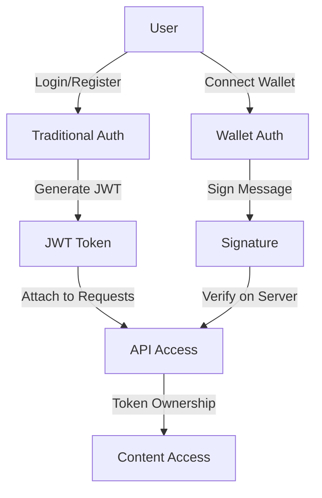

# Wylloh Platform Integration Review

## System Overview

The Wylloh platform is a comprehensive blockchain-based media licensing system that connects content creators with audiences through tokenized ownership. The platform consists of several integrated components that work together to provide a seamless experience for content creation, distribution, and consumption.

## Component Integration Analysis

### 1. Core Components Integration

| Component Pair | Integration Status | Integration Method | Potential Issues |
|----------------|-------------------|-------------------|------------------|
| Frontend ↔ API | Implemented | REST API with JWT auth | Error handling consistency |
| API ↔ Storage | Implemented | Internal API calls | Error propagation |
| Storage ↔ IPFS | Implemented | IPFS HTTP client | Error handling for IPFS unavailability |
| API ↔ Blockchain | Implemented | Ethers.js library | Transaction failure handling |
| Seed One ↔ Kodi | Implemented | Local REST API | Connection resilience |
| Frontend ↔ Wallet | Implemented | Web3React | Network switching handling |

### 2. Authentication Flow Integration

The authentication system uses both traditional JWT-based authentication and blockchain wallet-based authentication:

**Strengths:**
- Multiple authentication methods provide flexibility
- JWT implementation is consistent across services
- Wallet integration allows for secure blockchain verification

**Areas for Improvement:**
- The relationship between traditional and wallet authentication could be more clearly defined
- Token refresh mechanism needs implementation

### 3. Content Lifecycle Integration

The content lifecycle is well-integrated across components:

**Strengths:**
- Clear separation of concerns between components
- Consistent data flow between services
- Secure content storage and retrieval

**Areas for Improvement:**
- Manual steps between upload and tokenization
- More robust error handling during IPFS operations

### 4. Configuration Management Integration

Configuration is handled differently across components:

| Component | Configuration Method | Storage Location |
|-----------|---------------------|------------------|
| Frontend | Environment variables | .env file |
| API | Environment variables | .env file |
| Storage | Environment variables | .env file |
| Seed One | Electron store | User data directory |
| Kodi Addon | Settings XML | Kodi user data |

**Strengths:**
- Environment-based configuration for server components
- Persistent settings for desktop applications

**Areas for Improvement:**
- Standardize configuration approach across services
- Implement configuration validation

## Critical Integration Points

### 1. License Verification

This is a critical integration point that spans multiple components:

- **API Service**: Verifies token ownership
- **Blockchain**: Provides token data and rights information
- **Seed One Player**: Implements verification during playback
- **Kodi Addon**: Relies on Seed One for verification

**Current Status:** Implemented but could benefit from standardization

**Recommendation:** Create a standard verification protocol across all playback environments

### 2. Wallet Integration

Wallet functionality is used across multiple components:

- **Frontend**: Web3React for wallet connection
- **API**: Signature verification
- **Seed One**: Native wallet implementation
- **Smart Contracts**: Token creation and rights management

**Current Status:** Implemented with some inconsistencies

**Recommendation:** Standardize wallet interaction patterns

### 3. IPFS Content Storage and Retrieval

Content storage and retrieval is fundamental to the platform:

- **Storage Service**: Manages IPFS integration
- **API**: Coordinates content metadata
- **Seed One**: Retrieves content for playback
- **Frontend Player**: Streams content for web playback

**Current Status:** Implemented but needs error handling improvements

**Recommendation:** Enhance resilience against IPFS network issues

## Integration Gaps and Recommendations

### 1. Error Handling Standardization

**Gap:** Error handling patterns differ across components

**Recommendation:** 
- Implement a consistent error format across all services
- Create shared error handling utilities
- Establish clear error propagation patterns

### 2. Authentication Integration

**Gap:** Relationship between JWT and wallet-based authentication is not clearly defined

**Recommendation:**
- Document the authentication hierarchy
- Implement a unified authentication service
- Create clear rules for when each method is used

### 3. Service Discovery and Communication

**Gap:** Service communication relies on configured endpoints

**Recommendation:**
- Consider implementing service discovery mechanisms
- Add health checking between services
- Implement circuit breakers for resilience

### 4. Testing Integration

**Gap:** Integration testing across components is limited

**Recommendation:**
- Create end-to-end test suites
- Implement contract tests between services
- Add automated integration testing to CI/CD pipeline

## Security Integration Analysis

### 1. Content Protection

The content protection system spans multiple components:

- **Storage Service**: Encryption at rest
- **API**: Access control
- **Blockchain**: Rights verification
- **Players**: Secure playback

**Current Status:** Well-implemented with multiple layers of protection

**Recommendation:** Add additional monitoring for unauthorized access attempts

### 2. Key Management

Key management is distributed across components:

- **Storage Service**: Encryption keys
- **API**: JWT secrets
- **Seed One**: Wallet keys
- **Blockchain**: Private keys

**Current Status:** Basic implementation with some security considerations

**Recommendation:** Implement a more robust key management system with rotation policies

## Performance Integration Considerations

### 1. Content Delivery

**Current Approach:** Content is delivered through IPFS gateways

**Potential Issues:**
- IPFS gateway performance can vary
- Large files may experience slow initial load times

**Recommendation:**
- Implement content delivery acceleration
- Consider CDN integration for frequently accessed content
- Add adaptive quality based on connection speed

### 2. Blockchain Interaction

**Current Approach:** Direct blockchain interactions for verification

**Potential Issues:**
- Blockchain queries can be slow
- Network congestion can affect response times

**Recommendation:**
- Implement caching for blockchain queries
- Create a verification service that batches requests
- Consider implementing state channels for frequent operations

## Data Consistency Across Components

### 1. Content Metadata

**Current Approach:** Content metadata stored in API database and referenced in tokenization

**Potential Issues:**
- Potential for data drift between blockchain and database
- Multiple sources of truth

**Recommendation:**
- Implement synchronization mechanisms
- Create validation processes to ensure consistency
- Consider using blockchain as the primary source of truth with database as cache

### 2. User Account Information

**Current Approach:** User data stored in API database, wallet addresses linked to accounts

**Potential Issues:**
- Multiple wallet addresses per user
- Account recovery mechanisms

**Recommendation:**
- Implement robust linking between traditional accounts and wallet addresses
- Create clear flows for account recovery
- Add verification for wallet address changes

## Deployment and Scaling Integration

### 1. Deployment Coordination

**Current Approach:** Components deployed individually

**Potential Issues:**
- Version compatibility between components
- Deployment sequencing dependencies

**Recommendation:**
- Create deployment manifests for coordinated releases
- Implement API versioning for backward compatibility
- Add service health endpoints for deployment verification

### 2. Scaling Characteristics

**Component Scaling Needs:**
- **Frontend:** Standard web scaling (CDN, load balancing)
- **API:** Horizontal scaling for request handling
- **Storage:** Scaling for large file handling and chunked uploads
- **Blockchain Integration:** Primarily I/O bound, benefits from connection pooling
- **Seed One:** Client-side application, no server scaling needed

**Recommendation:**
- Implement auto-scaling based on load metrics
- Create independent scaling policies for each service
- Add performance monitoring across all services

## Future Integration Considerations

### 1. Additional Platforms

**Current Coverage:** Web, desktop (Seed One), Kodi

**Future Opportunities:**
- Mobile applications (iOS, Android)
- Smart TV platforms
- Game consoles
- VR/AR platforms

**Integration Requirements:**
- Abstract client-side license verification
- Create platform-specific playback components
- Standardize API interactions

### 2. Expanded Content Types

**Current Support:** Video, audio, documents

**Future Opportunities:**
- Interactive content
- AR/VR experiences
- Games and applications
- Live content and streams

**Integration Requirements:**
- Extend content type classification
- Create specialized players for new content types
- Enhance rights management for interactive content

### 3. Cross-Platform Ecosystem

**Current State:** Platform-specific experiences

**Future Vision:**
- Seamless content experience across devices
- Synchronized playback state
- Cross-device content transfer

**Integration Requirements:**
- User state synchronization service
- Content position tracking
- Device authentication federation

## Conclusion and Recommendations

The Wylloh platform demonstrates a well-thought-out architecture with clear separation of concerns and appropriate integration between components. The use of blockchain technology for rights management provides a robust foundation for the content licensing system.

### Key Strengths

1. **Modular Architecture:** Components have clear responsibilities and interfaces
2. **Multi-Layer Security:** Authentication, encryption, and rights verification provide defense in depth
3. **Blockchain Integration:** Leverages blockchain for verifiable ownership without compromising user experience
4. **Multi-Platform Support:** Web, desktop, and media center integration

### Priority Recommendations

1. **Standardize Error Handling:** Create a consistent approach to error handling across all services
2. **Enhance Authentication Integration:** Clarify the relationship between traditional and wallet-based authentication
3. **Implement Cross-Service Monitoring:** Add comprehensive monitoring across all components
4. **Create Integration Test Suite:** Develop automated tests for critical integration points
5. **Documentation Enhancement:** Complete API contracts and integration specifications

By addressing these recommendations, the Wylloh platform can further strengthen its integration points and provide an even more seamless experience for creators and consumers while maintaining the security and reliability of the content licensing system.