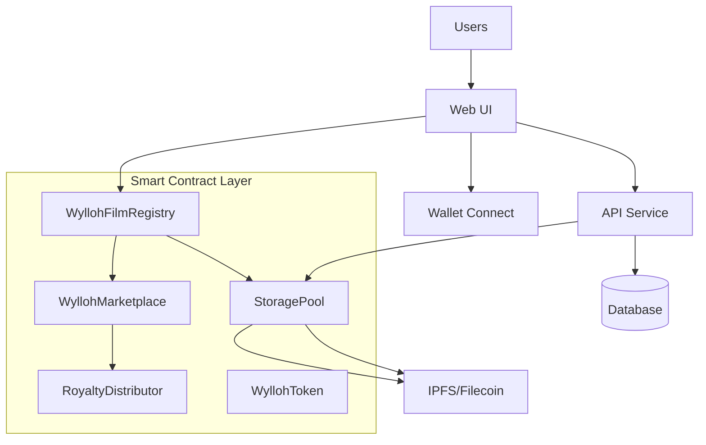

# Wylloh Platform Architecture Overview

## System Architecture

The Wylloh platform introduces a revolutionary single-contract architecture for beta launch, optimizing for scalability and user experience while maintaining security and decentralization.

## Components Overview

### 1. Smart Contract Layer
- **WyllohFilmRegistry**: Master ERC-1155 contract managing all films as token IDs
  - Token ID 1: The Cocoanuts (1929)
  - Fixed $4.99 USDC pricing
  - Gas-subsidized operations
  - Scalable to thousands of films

- **WyllohMarketplace**: Integrated trading optimized for registry tokens
  - Direct integration with WyllohFilmRegistry
  - USDC-only payments
  - Automated royalty distribution
  - Gas-efficient operations

- **Supporting Contracts**:
  - RoyaltyDistributor: Revenue sharing
  - StoragePool: IPFS funding
  - WyllohToken: Platform utility

### 2. Web UI (Frontend)
- **Technology**: React, TypeScript, Material UI
- **Beta Focus**: 
  - Simple USDC purchases
  - Gas fee subsidization
  - Clear beta messaging
  - Public domain content emphasis

### 3. API Service
- **Technology**: Express, TypeScript, JWT
- **Beta Features**:
  - Gas fee management
  - USDC payment processing
  - Registry integration
  - Content delivery

### 4. Storage Service
- **Technology**: IPFS/Filecoin
- **Beta Implementation**:
  - Public domain content storage
  - Optimized for scalability
  - Content encryption
  - Token-gated access

## Data Flow

### Content Registration Flow (Beta)
1. Admin registers The Cocoanuts in WyllohFilmRegistry
2. Content is processed and encrypted
3. IPFS storage with token-gated access
4. Fixed price set at $4.99 USDC

### Purchase Flow (Beta)
1. User connects wallet
2. Purchases token with USDC
3. Platform handles gas fees
4. Automatic rights verification
5. Instant content access

### Content Access Flow (Beta)
1. Token ownership verified
2. Decryption keys provided
3. Content streamed from IPFS
4. Platform subsidizes gas costs

## Security Architecture

The beta launch maintains robust security while simplifying user experience:

### Content Security
- AES-256 encryption
- Token-gated access
- IPFS content addressing
- Wallet-based verification

### Transaction Security
- Platform-subsidized gas
- USDC-only payments
- Automated verification
- Smart contract safety

## Analytics Architecture

Beta analytics focus on essential metrics while maintaining privacy:

### Key Metrics
- Token distribution
- Purchase patterns
- Gas cost monitoring
- Platform health

### Privacy Focus
- No personal data collection
- Blockchain-native insights
- Transparent methodology
- Anonymous analytics

## Network Architecture

- **Frontend**: Deployed on CDN for global distribution
- **API & Storage**: Deployed on cloud providers with auto-scaling
- **Database**: Managed database service with replication
- **IPFS Integration**: Connection to IPFS network with pinning services
- **Blockchain**: Integration with Polygon network (Mumbai testnet for development, Mainnet for production)

## Integration Points

The system has several key integration points:

1. **Frontend ↔ API**: REST API with JWT authentication
2. **API ↔ Storage**: Internal REST API
3. **Storage ↔ IPFS**: IPFS HTTP client
4. **Blockchain Integration**: Ethers.js library
5. **Seed One ↔ Kodi**: Local REST API

This architecture ensures scalability, security, and maintainability while providing a seamless user experience across multiple platforms.