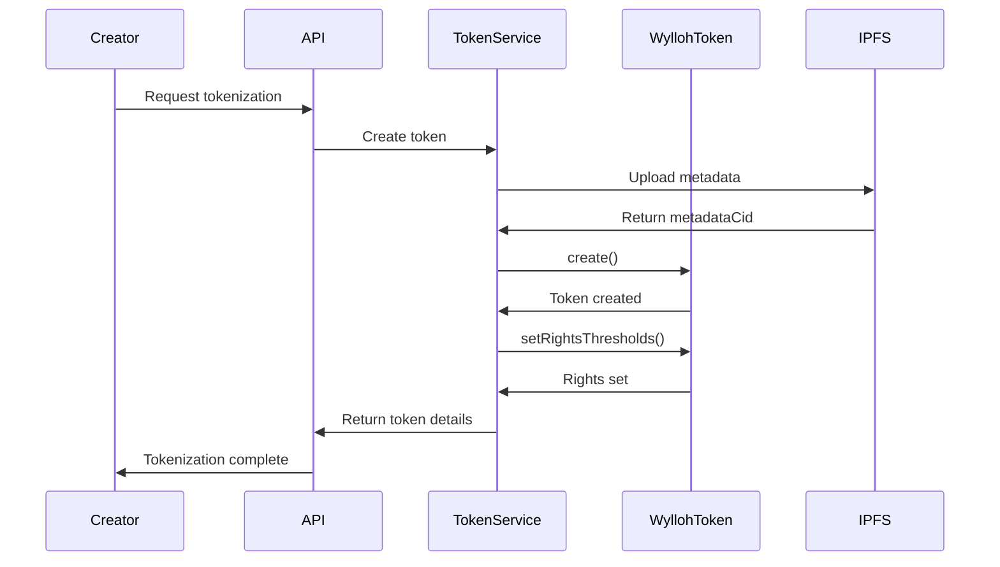
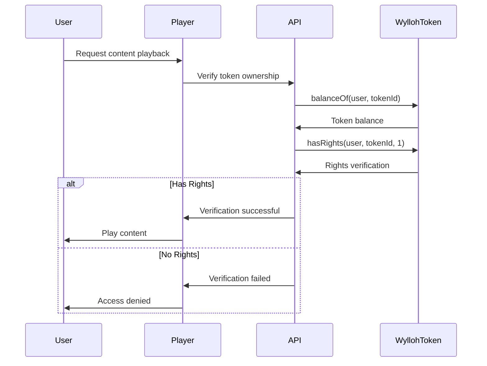
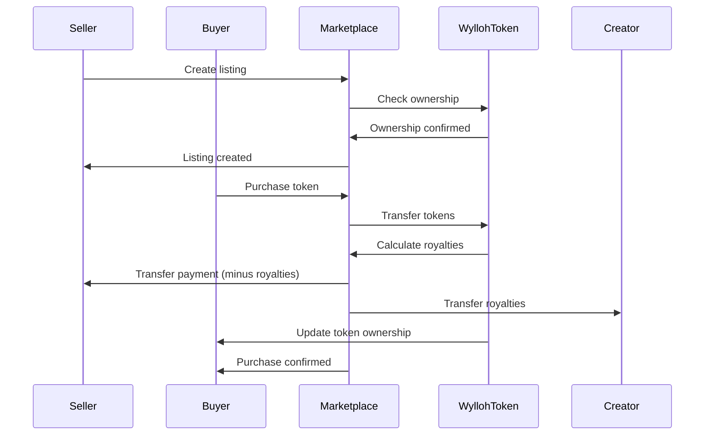

# Wylloh Smart Contracts Documentation

## Overview

The Wylloh platform uses smart contracts on the Polygon blockchain to manage content tokenization, rights management, and marketplace functionality. These contracts provide the foundation for the decentralized licensing system, enabling transparent and verifiable ownership and rights transactions.

*Note: This documentation is based on references in the codebase and may need updates when direct access to contract files is available.*

## Contract Architecture

The Wylloh smart contracts follow a modular architecture:

```
┌─────────────┐      ┌─────────────┐      ┌─────────────┐
│  WyllohToken│◄─────┤    Rights   │◄─────┤    Access   │
│   (ERC-1155)│      │  Management │      │   Control   │
└──────┬──────┘      └─────────────┘      └─────────────┘
       │
       │               ┌─────────────┐
       └──────────────►│  Royalty    │
                       │ Distribution│
                       └──────┬──────┘
                              │
┌─────────────┐              │
│  Marketplace│◄─────────────┘
│             │
└─────────────┘
```

## Core Contracts

### WyllohToken (ERC-1155)

The main token contract implementing the ERC-1155 multi-token standard with additional features for rights management.

**Key Features:**
- Multi-token support (ERC-1155)
- Content metadata storage
- Rights thresholds definition
- Royalty implementation

**Functions:**
- `create(address recipient, uint256 tokenId, uint256 initialSupply, string contentId, bytes32 contentHash, string contentType, string uri, address royaltyRecipient, uint96 royaltyPercentage)`: Create a new token for content
- `uri(uint256 tokenId)`: Get token metadata URI
- `getContentMetadata(uint256 tokenId)`: Get content metadata
- `setRightsThresholds(uint256 tokenId, uint256[] quantities, uint256[] rightsTypes)`: Set rights thresholds for a token
- `getRightsThresholds(uint256 tokenId)`: Get rights thresholds for a token
- `hasRights(address account, uint256 tokenId, uint256 rightsType)`: Check if an account has specific rights

### Rights Management

Manages the rights and permissions associated with tokens.

**Key Features:**
- Rights threshold definition
- Rights verification
- Rights delegation

**Rights Types:**
1. **Personal Viewing (1)**: Basic right to view content
2. **Small Venue (2)**: Right to display in small venues
3. **Streaming (3)**: Right to stream on platforms
4. **Public Performance (4)**: Right for public screenings
5. **Distribution (5)**: Right to distribute content
6. **Derivative Works (6)**: Right to create derivative works

### Royalty Distribution

Implements royalty management for content creators.

**Key Features:**
- Creator royalty settings
- Automatic royalty distribution
- Royalty tracking

**Functions:**
- `royaltyInfo(uint256 tokenId, uint256 salePrice)`: Get royalty information for a token

### Marketplace

Facilitates buying and selling of content licenses.

**Key Features:**
- Listing management
- Purchase functionality
- Escrow for secure transactions
- Fee handling

## Token Structure

### Token Metadata

Each token contains metadata stored on IPFS:

```json
{
  "name": "Content Title",
  "description": "Content Description",
  "image": "ipfs://Qm...", // Thumbnail or poster image
  "properties": {
    "contentType": "movie",
    "contentId": "content123",
    "contentCid": "QmXYZ...",
    "metadataCid": "QmABC..."
  },
  "rights": [
    {
      "quantity": 1,
      "rightsType": 1,
      "description": "Personal Viewing"
    },
    {
      "quantity": 100,
      "rightsType": 2,
      "description": "Small Venue (50 seats)"
    }
  ]
}
```

### Rights Thresholds

Rights are determined by token quantity:

| Rights Type | Minimum Quantity | Description |
|-------------|------------------|-------------|
| 1 | 1 | Personal Viewing |
| 2 | 100 | Small Venue (50 seats) |
| 3 | 5000 | Streaming Platform |
| 4 | 10000 | Theatrical Exhibition |

## Contract Deployment

Contracts are deployed to the Polygon network:

- **Development**: Mumbai Testnet (Chain ID: 80001)
- **Production**: Polygon Mainnet (Chain ID: 137)

## Token Creation Flow



## Rights Verification Flow



## Marketplace Flow



## Interacting with Contracts

### Through API

The platform interacts with contracts primarily through the TokenService:

```typescript
async createToken(tokenData: TokenCreationData) {
  // Generate a unique token ID
  const tokenIdBytes = ethers.utils.solidityKeccak256(
    ['string', 'string', 'uint256'],
    [tokenData.contentId, tokenData.contentCid, Date.now()]
  );
  const tokenId = ethers.BigNumber.from(tokenIdBytes);

  // Upload metadata to IPFS
  const metadataCid = await ipfsService.uploadMetadata(metadata);
  const tokenURI = `ipfs://${metadataCid}`;

  // Create token transaction
  const tx = await this.tokenContract.create(
    creatorAddress,      // initial token recipient
    tokenId,             // token ID
    tokenData.totalSupply, // initial supply
    tokenData.contentId, // content ID
    contentHash,         // content hash
    tokenData.contentType, // content type
    tokenURI,            // token URI
    creatorAddress,      // royalty recipient
    tokenData.royaltyPercentage // royalty percentage
  );

  // Wait for transaction to be mined
  const receipt = await tx.wait();

  // Set rights thresholds
  if (tokenData.rightsThresholds.length > 0) {
    const quantities = tokenData.rightsThresholds.map(t => t.quantity);
    const rightsTypes = tokenData.rightsThresholds.map(t => t.rightsType);
    
    const rightsTx = await this.tokenContract.setRightsThresholds(
      tokenId,
      quantities,
      rightsTypes
    );
    
    await rightsTx.wait();
  }

  return {
    tokenId: tokenId.toString(),
    contractAddress: this.contractAddress,
    owner: creatorAddress,
    totalSupply: tokenData.totalSupply,
    transactionHash: receipt.transactionHash,
    tokenURI
  };
}
```

### Through Wallet Applications

Users can interact with contracts directly through wallet applications:

1. **View Owned Tokens**: Check token balances
2. **Transfer Tokens**: Send tokens to other addresses
3. **List Tokens**: Create marketplace listings
4. **Purchase Tokens**: Buy tokens from marketplace

## Contract Security

The contracts implement several security measures:

1. **Access Control**: Role-based access for administrative functions
2. **Pausability**: Emergency pause functionality 
3. **Upgrade Mechanisms**: Contract upgradeability for future improvements
4. **Safe Transfer Handling**: Secure token transfer mechanisms
5. **Royalty Enforcement**: Automatic royalty calculation and distribution

## Development and Deployment

### Development Tools

- **Framework**: Hardhat
- **Testing**: Waffle, Ethers.js
- **Documentation**: NatSpec
- **Verification**: Solidity Coverage

### Deployment Process

1. **Compilation**: Compile contracts with optimizations
2. **Testing**: Run comprehensive test suite
3. **Deployment**: Deploy to target network (Mumbai/Polygon)
4. **Verification**: Verify contract code on blockchain explorer
5. **Configuration**: Set up initial contract parameters

## Further Documentation

For detailed information on contract functions, events, and implementation specifics, refer to:

1. Contract NatSpec documentation
2. Solidity source code
3. Contract ABIs in the repository

*Note: This documentation will be updated when direct access to contract files is available.*