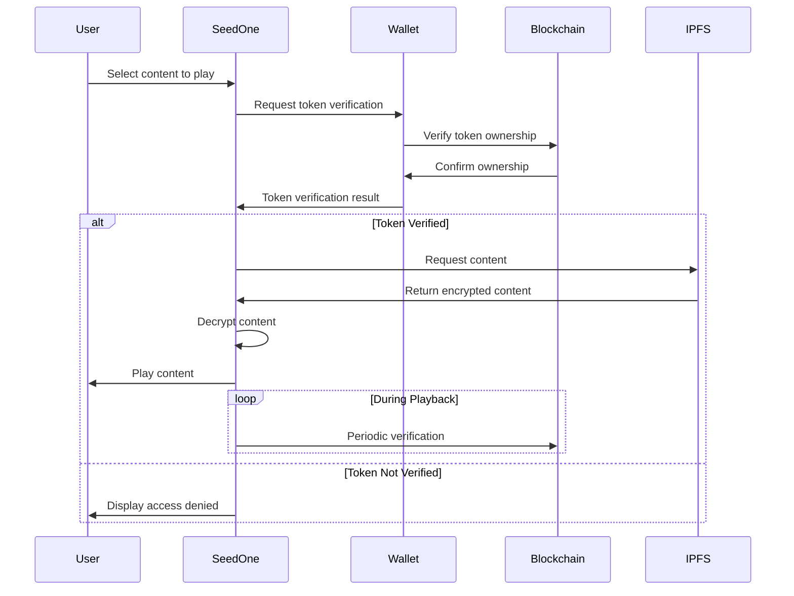

# Seed One Documentation

## Overview

Seed One is a dedicated media player application for the Wylloh platform, designed to provide secure playback of tokenized content with blockchain-based license verification. It serves as a specialized client for accessing licensed content while ensuring proper rights management and authentication.

## Architecture

Seed One consists of several integrated components:

```
┌───────────────────────────────────────────────────────┐
│                     Seed One App                      │
│                                                       │
│  ┌───────────┐   ┌───────────┐   ┌───────────────┐   │
│  │   Media   │   │  Wallet   │   │    License    │   │
│  │  Player   │◄─►│ Connection│◄─►│  Verification │   │
│  └───────────┘   └───────────┘   └───────────────┘   │
│         ▲               ▲                ▲           │
│         │               │                │           │
│  ┌──────▼──────┐ ┌──────▼───────┐ ┌─────▼────────┐  │
│  │ IPFS/Storage│ │  Blockchain  │ │    Local     │  │
│  │ Integration │ │  Integration │ │ API Server   │  │
│  └─────────────┘ └──────────────┘ └──────────────┘  │
└───────────────────────────────────────────────────────┘
```

## Components

### Main Application (`src/index.js`)

The Chromium-based desktop application provides the primary user interface and orchestrates the different components of the Seed One player.

Key features:
- Content library browsing and management
- Media playback with license verification
- Wallet connection and management
- Settings and configuration
- Integrated marketplace and upload features

### Wallet Connection (`wallet/connection.js`)

Manages integration with blockchain wallets for license verification:

- Connection to Polygon network
- Wallet creation and importing
- Token ownership verification
- Signature handling for authentication

### License Verification (`utils/licenseVerifier.js`)

Ensures proper content rights:

- Token ownership verification
- Rights level validation
- Periodic verification during playback
- Integration with smart contracts for verification

### Local API Server (`api/server.js`)

Provides a local HTTP API for integration with external components:

- Endpoints for wallet interaction
- License verification requests
- Content status checking
- Token management

## Content Playback Workflow



## Installation

### System Requirements

- **Operating System**: Windows 10/11, macOS 10.14+, or Linux
- **RAM**: 4GB minimum, 8GB recommended
- **Processor**: Dual-core 2GHz or better
- **Storage**: 1GB free space minimum
- **Network**: Broadband internet connection
- **Blockchain**: Access to Polygon network (Mumbai testnet or Mainnet)

### Installation Methods

#### Standalone Application

1. Download the installer from the Wylloh website
2. Run the installer package for your platform
3. Follow the on-screen instructions
4. Launch the application

## Configuration

The Seed One application can be configured through the settings interface or by editing the configuration files directly.

### Application Settings

- **Playback Settings**: Quality, buffering, subtitles
- **Wallet Settings**: Network, connection type
- **Storage Settings**: Cache size, storage location
- **Network Settings**: IPFS gateway, API endpoints

### Configuration Files

Configuration is stored in:
- Windows: `%APPDATA%\Seed-One\config.json`
- macOS: `~/Library/Application Support/Seed-One/config.json`
- Linux: `~/.config/Seed-One/config.json`

## Wallet Management

### Creating a New Wallet

The application can create a new wallet specifically for the device:

1. Launch Seed One
2. Navigate to Wallet settings
3. Click "Create New Wallet"
4. Set a password for the wallet
5. Backup the recovery phrase securely

### Importing an Existing Wallet

To use an existing wallet:

1. Navigate to Wallet settings
2. Click "Import Wallet"
3. Choose import method (private key, mnemonic, etc.)
4. Enter the wallet credentials
5. Set a password for local wallet encryption

### Connecting to External Wallets

For integration with external wallets:

1. Navigate to Wallet settings
2. Click "Connect External Wallet"
3. Select wallet type (MetaMask, WalletConnect, etc.)
4. Approve the connection request in your wallet

## Content Management

### Browsing Content

Content can be browsed through the library interface:

1. Owned content appears in the "My Library" section
2. Content is organized by type (movies, series, etc.)
3. Search functionality allows finding specific titles
4. Filtering options for content types and genres

### Playing Content

To play content:

1. Select the content from the library
2. License verification happens automatically
3. Content is streamed from IPFS through the Storage Service
4. Playback controls allow for standard media interactions

### Content Information

Each content item displays:

- Title and description
- Creator information
- Token ownership details
- Rights level information
- Additional metadata (genre, duration, etc.)

## Security Features

Seed One implements several security measures:

1. **Encrypted Storage**: Local wallet and user data is encrypted
2. **Secure Playback**: Content is decrypted only for authorized playback
3. **Periodic Verification**: License is verified periodically during playback
4. **Secure API**: Local API server requires authentication
5. **Sandboxed Execution**: Content playback occurs in a sandboxed environment

## Troubleshooting

### Common Issues

**Unable to Connect Wallet**
- Check network connection
- Verify correct network settings (Polygon Mainnet/Mumbai)
- Restart the application

**Content Not Playing**
- Verify token ownership in wallet
- Check internet connection
- Clear the application cache

### Logs and Diagnostics

Logs are stored in:
- Windows: `%APPDATA%\Seed-One\logs`
- macOS: `~/Library/Application Support/Seed-One/logs`
- Linux: `~/.config/Seed-One/logs`

## Development Information

### Technologies Used

- **Electron**: Application framework
- **Node.js**: Runtime environment
- **Ethers.js**: Blockchain interaction
- **IPFS HTTP Client**: IPFS integration
- **Python**: Kodi addon development

### Extension Points

Seed One can be extended through:

1. **API Integration**: Using the local API server
2. **Kodi Addon**: Customizing the Kodi addon
3. **Custom Skins**: Creating custom UI themes
4. **Plugins**: Adding new functionality via plugins

## Updating

Seed One checks for updates automatically. When a new version is available:

1. A notification appears in the application
2. Click "Download Update" to get the latest version
3. The application will guide you through the update process
4. Restart the application to complete the update

## License and Legal

Seed One is proprietary software:

- Licensed for personal use only
- Redistribution is not permitted
- Modifications are not permitted without authorization
- Use is subject to the Wylloh Terms of Service

## Support and Resources

- **Website**: https://wylloh.com/seed-one
- **Documentation**: https://docs.wylloh.com/seed-one
- **Support**: support@wylloh.com
- **Community Forum**: https://forum.wylloh.com