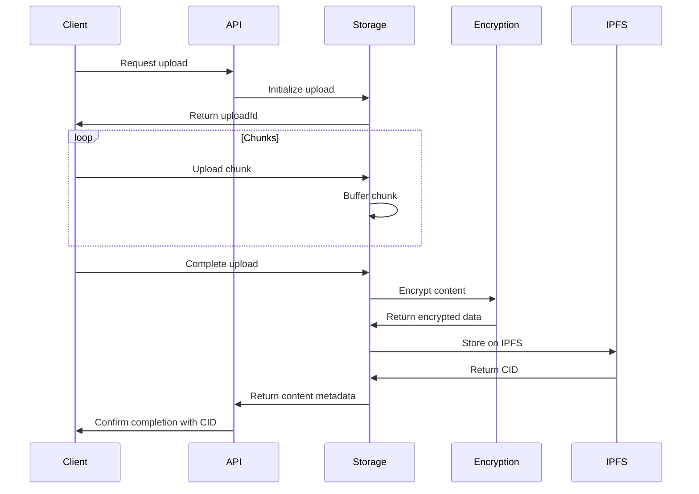
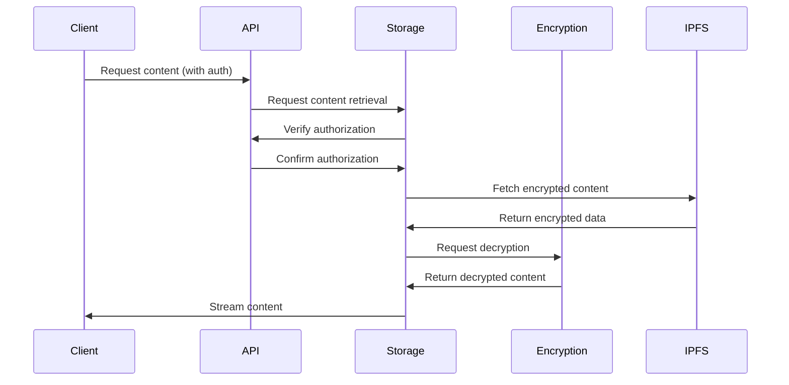

# Wylloh Storage Service Documentation

## Overview

The Wylloh Storage Service is responsible for managing content storage, encryption, and retrieval through IPFS and Filecoin networks. It provides a secure layer for uploading, storing, and accessing content with proper authorization.

## Architecture

The Storage Service acts as a middleware between the Wylloh platform and decentralized storage networks. It manages:

1. Content encryption and decryption
2. IPFS integration for content storage and retrieval
3. Metadata management
4. Access control and authorization

```
┌─────────────┐    ┌─────────────┐    ┌─────────────┐
│  API Layer  │◄──►│ Storage Svc │◄──►│IPFS/Filecoin│
└─────────────┘    │             │    └─────────────┘
                   │             │    ┌─────────────┐
┌─────────────┐    │             │◄──►│ Encryption  │
│  Web/Seed   │◄──►│             │    │  Service    │
│    Client   │    └─────────────┘    └─────────────┘
└─────────────┘
```

## Service Components

### IPFS Service

The IPFS Service (`ipfsService.ts`) provides the core functionality for interacting with IPFS networks:

- **Content Upload**: Uploading files to IPFS
- **Content Retrieval**: Fetching content from IPFS by CID
- **Content Pinning**: Ensuring content persistence on IPFS
- **Metadata Storage**: Storing and retrieving JSON metadata

### Encryption Service

The Encryption Service handles content security:

- **Content Encryption**: AES-256-GCM encryption for content files
- **Key Management**: Secure storage and management of encryption keys
- **Decryption**: Authorized content decryption for playback
- **Access Control**: Management of content access credentials

#### Encryption Implementation

The encryption system is implemented with the following components:

1. **EncryptionUtils** (`encryption.ts`):
   - Provides utility functions for encrypting and decrypting content
   - Uses AES-256 encryption with secure key handling
   - Supports both content encryption and key encryption

2. **KeyManagementService** (`keyManagement.service.ts`):
   - Manages secure storage and retrieval of content keys
   - Associates keys with specific content IDs
   - Verifies token ownership before providing access to keys
   - Implements a caching system for improved performance

3. **UploadService** (`upload.service.ts`):
   - Handles the secure upload process
   - Encrypts files before uploading to IPFS
   - Manages encryption keys during the upload process
   - Stores encryption metadata securely

4. **DownloadService** (`download.service.ts`):
   - Manages secure content retrieval
   - Verifies user authorization before allowing content access
   - Handles decryption of content for authorized users
   - Provides streaming and download capabilities with on-the-fly decryption

#### Encryption Workflow

The encryption process follows these steps:

1. **Content Upload**:
   - Content is encrypted client-side using a unique encryption key
   - The encryption key is itself encrypted with a key derived from the content contract
   - Encrypted content is uploaded to IPFS, receiving a content CID
   - The encrypted key is stored securely, associated with the content ID

2. **Content Access**:
   - User requests access to content
   - System verifies token ownership through blockchain integration
   - If authorized, the encrypted key is retrieved and decrypted
   - Content is streamed or downloaded and decrypted client-side

3. **Key Security**:
   - Keys are never stored in plaintext
   - Key access requires blockchain verification
   - Keys are associated with wallet addresses for additional security

### Content Storage Controller

The Content Storage Controller coordinates the storage workflow:

- **Chunked Uploads**: Managing large file uploads in manageable chunks
- **Upload Coordination**: Tracking upload progress and status
- **Storage Processing**: Preprocessing content for optimal storage
- **Completion Handling**: Finalizing uploads and generating metadata

## Content Storage Workflow



## Encryption Process

The encryption process secures content before storage:

1. Generate a random encryption key for each content item
2. Encrypt the content using AES-256-GCM encryption
3. Store the encrypted content on IPFS
4. Encrypt the encryption key using the user's public key
5. Store the encrypted key in the database, associated with the content

## Content Retrieval Workflow



## API Endpoints

### Content Upload

#### Initialize Upload

```
POST /api/content/upload
```

Initializes a new content upload, returning an uploadId for subsequent chunk uploads.

**Request Headers:**
- `Authorization: Bearer <token>`

**Response:**
```json
{
  "message": "Upload initialized",
  "uploadId": "upload-1234567890",
  "expiresAt": "2023-11-17T12:00:00.000Z"
}
```

#### Upload Chunk

```
POST /api/content/upload/:uploadId/chunk
```

Uploads a chunk of content data.

**Request Headers:**
- `Authorization: Bearer <token>`

**Form Data:**
- `chunk`: File chunk
- `chunkIndex`: Chunk index (0-based)
- `totalChunks`: Total number of chunks

**Response:**
```json
{
  "message": "Chunk uploaded",
  "uploadId": "upload-1234567890",
  "chunkIndex": 0,
  "receivedChunks": 1,
  "totalChunks": 10
}
```

#### Complete Upload

```
POST /api/content/upload/:uploadId/complete
```

Finalizes the upload process, processes the complete file, encrypts it, and stores it on IPFS.

**Request Headers:**
- `Authorization: Bearer <token>`

**Request Body:**
```json
{
  "title": "Content Title",
  "contentType": "movie",
  "encrypted": true,
  "metadata": {
    "duration": "120",
    "resolution": "1080p"
  }
}
```

**Response:**
```json
{
  "message": "Upload completed",
  "contentId": "content-1234567890",
  "cid": "QmXYZ123...",
  "encryptionReference": "enc-1234567890",
  "size": 104857600
}
```

### Content Retrieval

#### Get Content Status

```
GET /api/content/status/:contentId
```

Check the processing status of uploaded content.

**Request Headers:**
- `Authorization: Bearer <token>`

**Response:**
```json
{
  "message": "Content status retrieved",
  "contentId": "content-1234567890",
  "status": "ready",
  "cid": "QmXYZ123...",
  "size": 104857600,
  "encrypted": true
}
```

#### Get Content Metadata

```
GET /api/content/:contentId
```

Retrieve metadata for content.

**Request Headers:**
- `Authorization: Bearer <token>`

**Response:**
```json
{
  "message": "Content metadata retrieved",
  "content": {
    "id": "content-1234567890",
    "title": "Content Title",
    "contentType": "movie",
    "cid": "QmXYZ123...",
    "size": 104857600,
    "encrypted": true,
    "metadata": {
      "duration": "120",
      "resolution": "1080p"
    },
    "createdAt": "2023-11-15T12:00:00.000Z"
  }
}
```

### IPFS Integration

#### Get Content by CID

```
GET /api/ipfs/:cid
```

Retrieve content from IPFS by CID.

**Request Headers:**
- `Authorization: Bearer <token>`

**Query Parameters:**
- `decrypt`: Whether to decrypt the content (true/false)
- `encryptionKey`: Encryption key for decryption (if applicable)

**Response:**
Binary stream of content data or:

```json
{
  "message": "Content retrieved successfully",
  "cid": "QmXYZ123...",
  "size": 104857600,
  "gatewayUrl": "https://gateway.wylloh.com/ipfs/QmXYZ123..."
}
```

#### Pin Content

```
POST /api/ipfs/pin
```

Pin content to IPFS to ensure persistence.

**Request Headers:**
- `Authorization: Bearer <token>`

**Request Body:**
```json
{
  "cid": "QmXYZ123..."
}
```

**Response:**
```json
{
  "message": "Content pinned successfully",
  "cid": "QmXYZ123..."
}
```

#### Check Content Status

```
GET /api/ipfs/status/:cid
```

Check status of content on IPFS.

**Request Headers:**
- `Authorization: Bearer <token>`

**Response:**
```json
{
  "message": "Content status retrieved successfully",
  "cid": "QmXYZ123...",
  "exists": true,
  "pinned": true,
  "size": 104857600,
  "createdAt": "2023-11-15T12:00:00.000Z"
}
```

#### Store Metadata

```
POST /api/ipfs/metadata
```

Store metadata on IPFS.

**Request Headers:**
- `Authorization: Bearer <token>`

**Request Body:**
```json
{
  "metadata": {
    "title": "Content Title",
    "description": "Content Description",
    "creator": "Creator Name",
    "contentType": "movie",
    "duration": "120",
    "releaseYear": "2023",
    "tags": ["tag1", "tag2"]
  }
}
```

**Response:**
```json
{
  "message": "Metadata stored successfully",
  "cid": "QmABC123...",
  "gatewayUrl": "https://gateway.wylloh.com/ipfs/QmABC123..."
}
```

### Encryption Management

#### Get Public Key

```
GET /api/encryption/public-key
```

Retrieve the system public key for encryption.

**Response:**
```json
{
  "message": "Public key retrieved",
  "publicKey": "public-key-data"
}
```

#### Request Access Credentials

```
POST /api/encryption/access
```

Request access credentials for encrypted content.

**Request Headers:**
- `Authorization: Bearer <token>`

**Request Body:**
```json
{
  "contentId": "content-1234567890",
  "tokenId": "12345"
}
```

**Response:**
```json
{
  "message": "Access credentials provided",
  "contentId": "content-1234567890",
  "accessToken": "access-token-data",
  "expiresAt": "2023-11-16T13:00:00.000Z"
}
```

## Storage Configuration

The Storage Service is configurable through environment variables:

| Variable | Description | Default |
|----------|-------------|---------|
| `STORAGE_PORT` | Port for the Storage Service | 4001 |
| `IPFS_API_URL` | URL for IPFS API | http://localhost:5001 |
| `IPFS_GATEWAY_URL` | URL for IPFS Gateway | http://localhost:8080 |
| `ENCRYPTION_KEY` | Master encryption key | (required) |
| `JWT_SECRET` | Secret for JWT validation | (required) |

## Security Considerations

### Content Protection

The Storage Service employs several mechanisms to ensure content security:

1. **Encryption at Rest**: All content is encrypted before storage on IPFS
2. **Access Control**: JWT-based authentication for all API endpoints
3. **Temporary Access**: Time-limited access tokens for content retrieval
4. **License Verification**: Integration with blockchain-based license verification
5. **Secure Key Management**: Encryption keys are never stored in plaintext

### Content Retrieval Security

To access content, a client must:

1. Authenticate with a valid JWT token
2. Possess the appropriate license token (verified via blockchain)
3. Request temporary access credentials
4. Use the access credentials to retrieve the content
5. Decrypt the content using the provided decryption key

## IPFS Configuration

The Storage Service connects to IPFS nodes with the following configuration:

1. **Local Node**: For development and testing
2. **Dedicated Nodes**: For production deployment
3. **Pinning Services**: For content persistence
4. **Gateway Integration**: For public content access

## Filecoin Integration

For long-term storage, content can be stored on Filecoin:

1. **Storage Deals**: Automated creation of Filecoin storage deals
2. **Retrieval**: Integration with Filecoin retrieval mechanism
3. **Cost Management**: Optimization of storage costs
4. **Deal Status Tracking**: Monitoring active storage deals

## Implementation Notes

### Chunked File Handling

Large files are handled through a chunked upload process:

1. Client initiates upload and receives an uploadId
2. Client uploads file in chunks (recommended 5MB per chunk)
3. Server reassembles chunks in memory or temporary storage
4. Complete file is processed, encrypted, and stored on IPFS
5. Temporary chunks are removed after processing

### Content Versioning

For content updates, the system employs a versioning mechanism:

1. New versions create new IPFS entries
2. Metadata maintains version history
3. Original CIDs remain accessible for older versions
4. Token rights apply across all versions unless specified

## Performance Considerations

1. **Caching**: Frequently accessed content is cached for faster retrieval
2. **Concurrent Uploads**: Multiple chunk uploads can happen concurrently
3. **Streaming**: Content is streamed rather than loaded completely in memory
4. **Gateway Selection**: Dynamic selection of fastest IPFS gateway
5. **Load Balancing**: Distribution of requests across multiple instances